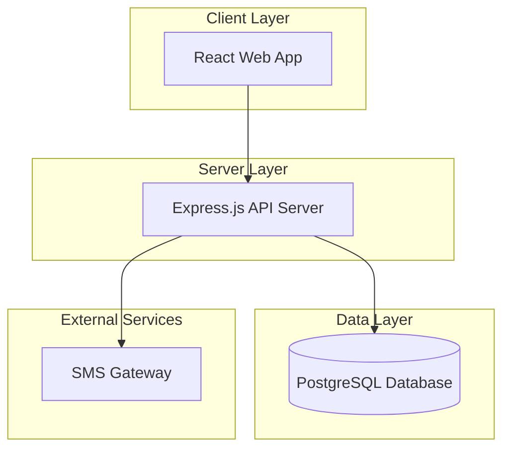
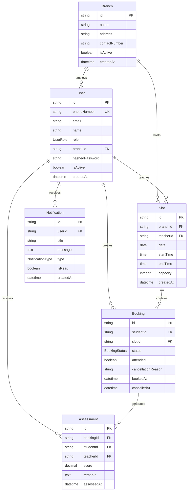

# Design Document

## Overview

The Speaking Test Booking Management System is a web-based MVP designed to digitize and validate the core booking flow at 10 Minute School offline English Learning Centers. This pilot system focuses on essential booking functionality for a single branch to validate user workflows before scaling.

### MVP Design Principles

- **Multi-Branch Support**: Cross-branch booking functionality from the start
- **Essential Features Plus**: Core booking, basic assessment recording, SMS + in-app notifications, minimal reporting
- **Simple Architecture**: Monolithic backend for fast development and deployment
- **Mobile-first Design**: Responsive interface using Shadcn/ui components
- **Quick Deployment**: Simple hosting setup for rapid iteration

## Architecture

### MVP System Architecture

Simple monolithic architecture for rapid development and deployment:



### Technology Stack

**Frontend:**
- React.js with TypeScript
- Shadcn/ui component library for professional UI
- Tailwind CSS for 10MS branding (red, white, dark theme)
- React Query for server state management

**Backend:**
- Node.js with Express.js (monolithic API)
- TypeScript for type safety
- JWT for authentication
- Supabase ORM for database operations
- Multer for CSV file uploads

**Database:**
- PostgreSQL for all data storage
- Simple table structure with proper relationships

**Infrastructure:**
- Single VPS or cloud instance
- Nginx for static file serving
- PM2 for process management
- Docker for containerization (optional)

## Components and Interfaces

### Core MVP Modules

#### 1. Authentication Module

**Purpose**: Simple user authentication and role management

**MVP Features:**
- Phone number authentication for students (SMS OTP)
- Email/password for staff
- Basic JWT tokens (no refresh tokens for MVP)
- Four user roles: Super-Admin, Branch-Admin, Teacher, Student

**Key API Endpoints:**
```typescript
POST /auth/student/login     // Phone + OTP
POST /auth/staff/login       // Email + Password  
GET  /auth/me               // Get current user
POST /auth/logout           // Simple logout
```

#### 2. Booking Module

**Purpose**: Core booking functionality with cross-branch support

**MVP Features:**
- View available slots across all branches (daily/weekly/monthly filters)
- Create bookings with duplicate prevention and branch selection
- Cancel/reschedule (24hr rule) with cross-branch options
- Mark attendance with branch context

**Key API Endpoints:**
```typescript
GET  /slots?date=&teacher=&branch=&view=  // Get available slots across branches
POST /bookings                            // Create booking (includes branchId)
PUT  /bookings/:id/cancel                // Cancel booking
PUT  /bookings/:id/reschedule            // Reschedule booking (cross-branch allowed)
PUT  /bookings/:id/attendance            // Mark attendance
GET  /branches                           // Get all branches
```

#### 3. Assessment Module

**Purpose**: Basic IELTS score recording

**MVP Features:**
- Record IELTS scores (0-9, 0.5 increments)
- Add text remarks
- View assessment history
- Simple rubrics reference

**Key API Endpoints:**
```typescript
POST /assessments                    // Record assessment
GET  /assessments/student/:id        // Get student assessments
GET  /rubrics                        // Get IELTS rubrics
```

#### 4. User Management Module

**Purpose**: Basic user and slot management

**MVP Features:**
- Bulk student import (CSV)
- Create/edit teacher schedules
- Manage slot availability
- Basic user CRUD

**Key API Endpoints:**
```typescript
POST /users/bulk-import             // CSV upload
GET  /users                         // List users
POST /slots                         // Create slots
PUT  /slots/:id                     // Update slots
```

#### 5. Notification Module

**Purpose**: SMS and in-app notifications

**MVP Features:**
- SMS booking confirmations
- In-app notification system with read/unread status
- SMS + in-app reminders (24hr before)
- SMS + in-app cancellation alerts
- Notification templates for both channels

**Key API Endpoints:**
```typescript
POST /notifications/sms                    // Send SMS
POST /notifications/in-app                 // Create in-app notification
GET  /notifications/user/:id               // Get user notifications
PUT  /notifications/:id/read               // Mark notification as read
GET  /notifications/templates              // Get templates
```

#### 6. Reporting Module

**Purpose**: Minimal reporting dashboard with key metrics

**MVP Features:**
- Real-time booking and attendance metrics
- Branch-wise performance comparison
- Teacher utilization and student no-show rates
- Basic charts and export functionality

**Key API Endpoints:**
```typescript
GET  /reports/dashboard                    // Get dashboard metrics
GET  /reports/attendance?branch=&teacher=  // Attendance reports
GET  /reports/utilization?branch=          // Slot utilization metrics
POST /reports/export                       // Export reports as CSV
```

### MVP User Interfaces & URL Architecture

The system uses a **Hybrid URL Approach** combining unified URLs for common features with admin-specific routes for management functions.

#### URL Architecture Principles

**Hybrid Approach**: Combines unified URLs for common features with admin-specific routes for management functions.

**Unified URLs** (Role-based content):
- Same URL shows different content based on user role
- Clean, professional URLs without role exposure
- Easy to remember and bookmark

**Admin-Specific URLs** (Protected routes):
- `/admin/*` prefix for management functions
- Clear separation of administrative features
- Role-based access control at route level

#### URL Structure
```
/                    - Landing/Login page
/dashboard          - Role-based dashboard (different content per role)
/schedule           - Available slots (students) / My schedule (teachers)
/bookings           - My bookings (students) / My sessions (teachers)
/assessments        - My scores (students) / Record scores (teachers)
/notifications      - Notification center (all roles)
/settings           - Profile settings (all roles)
/admin/branches     - Branch management (Super-Admin only)
/admin/users        - User management (Branch-Admin, Super-Admin)
/admin/reports      - Advanced reporting (Branch-Admin, Super-Admin)
/admin/slots        - Slot management (Branch-Admin, Super-Admin)
/admin/import       - Bulk student import (Branch-Admin, Super-Admin)
```

**Route Protection**:
- Public routes: `/`, `/login/*`
- Authenticated routes: `/dashboard`, `/schedule`, `/bookings`, `/assessments`, `/notifications`, `/settings`
- Admin routes: `/admin/*` (role-specific access control)
- 404 fallback: `/not-found`
- Unauthorized access: `/unauthorized`

#### Student Portal (Mobile-First)
- **Dashboard** (`/dashboard`): Simple card layout showing next booking, notifications, and quick "Book Now" button
- **Schedule Browser** (`/schedule`): Calendar view with available slots across branches, filters for date/teacher/branch
- **My Bookings** (`/bookings`): List of current/past bookings with cancel/reschedule options (cross-branch)
- **My Scores** (`/assessments`): Simple table of IELTS scores and teacher remarks
- **Notifications** (`/notifications`): In-app notification center with read/unread status
- **Profile** (`/settings`): Basic profile and preferences

**Key Shadcn Components**: Card, Button, Calendar, Table, Dialog, Badge (for notifications)

#### Teacher Portal
- **Dashboard** (`/dashboard`): Today's schedule overview with quick actions
- **My Schedule** (`/schedule`): Weekly/monthly calendar view of assigned slots
- **My Sessions** (`/bookings`): List of upcoming and past sessions with student details
- **Record Assessment** (`/assessments`): Form with IELTS score input (0-9) and remarks textarea
- **Notifications** (`/notifications`): Session updates and system alerts
- **Profile** (`/settings`): Basic profile settings

**Key Shadcn Components**: DataTable, Form, Input, Textarea, Calendar

#### Branch Admin Portal
- **Dashboard** (`/dashboard`): Branch overview with key metrics and today's bookings
- **Schedule Management** (`/schedule`): View all branch schedules (read-only for admins)
- **Session Overview** (`/bookings`): Today's bookings and attendance tracking for their branch
- **Assessment Reports** (`/assessments`): Branch assessment analytics and teacher performance
- **Notifications** (`/notifications`): System alerts and branch updates
- **Profile** (`/settings`): Basic profile settings
- **Slot Management** (`/admin/slots`): Create weekly schedule templates, manage teacher assignments
- **Student Import** (`/admin/import`): CSV upload with progress indicator and error reporting
- **User Management** (`/admin/users`): Manage teachers and students within branch
- **Reports Dashboard** (`/admin/reports`): Branch-specific metrics with charts and export functionality

**Key Shadcn Components**: Form, FileUpload, DataTable, Progress, Charts

#### Super Admin Portal
- **Dashboard** (`/dashboard`): System-wide overview with cross-branch metrics and comparative charts
- **System Schedule** (`/schedule`): View all schedules across branches (read-only overview)
- **All Sessions** (`/bookings`): System-wide booking overview and analytics
- **Assessment Analytics** (`/assessments`): Cross-branch assessment performance and trends
- **Notifications** (`/notifications`): System alerts and administrative updates
- **Profile** (`/settings`): Basic profile settings
- **Branch Management** (`/admin/branches`): Add/edit branches, assign branch admins
- **User Management** (`/admin/users`): Add/remove all user roles across branches
- **System Reports** (`/admin/reports`): System-wide reporting with branch comparisons and export options
- **System Configuration** (`/admin/settings`): Business rules, notification templates, system settings

**Key Shadcn Components**: Card, DataTable, Form, Charts, Tabs

## Data Models

### MVP Database Schema



### MVP Types

```typescript
enum UserRole {
  SUPER_ADMIN = 'super_admin',
  BRANCH_ADMIN = 'branch_admin', 
  TEACHER = 'teacher',
  STUDENT = 'student'
}

enum BookingStatus {
  CONFIRMED = 'confirmed',
  CANCELLED = 'cancelled', 
  COMPLETED = 'completed',
  NO_SHOW = 'no_show'
}

enum NotificationType {
  BOOKING_CONFIRMED = 'booking_confirmed',
  BOOKING_REMINDER = 'booking_reminder',
  BOOKING_CANCELLED = 'booking_cancelled',
  SYSTEM_ALERT = 'system_alert'
}

interface SlotFilters {
  branchId?: string
  teacherId?: string
  date?: string
  view: 'daily' | 'weekly' | 'monthly'
}

interface CreateBookingRequest {
  slotId: string
  studentPhoneNumber: string
}

interface AssessmentRequest {
  bookingId: string
  score: number // 0-9 with 0.5 increments
  remarks: string
}

interface DashboardMetrics {
  totalBookings: number
  attendanceRate: number
  utilizationRate: number
  noShowRate: number
  branchBreakdown?: BranchMetrics[]
}
```

## Error Handling

### MVP Error Strategy

**Simple Error Response:**
```typescript
interface ErrorResponse {
  error: string
  message: string
  statusCode: number
}
```

**Key Error Cases:**
- 400: Invalid booking data, duplicate bookings
- 401: Invalid credentials, expired tokens
- 403: Role permission denied
- 404: Slot/booking not found
- 500: Database errors, SMS failures

**Error Handling:**
- Client-side validation with Shadcn form components
- Server-side validation with clear error messages
- SMS failure fallback: show confirmation on screen
- Database errors: simple retry logic

## Testing Strategy

### MVP Testing Approach

**Integration Tests (Focus Area):**
- Core booking flow: browse → book → confirm → cancel
- Authentication: student phone login, staff email login
- Assessment recording: score entry and retrieval
- CSV import: student bulk upload

**Manual QA:**
- Mobile responsiveness on actual devices
- SMS delivery testing
- User role permissions
- Edge cases (duplicate bookings, cancellation rules)

**Test Data:**
- Simple seed script with sample users and slots
- Mock SMS service for development
- Basic error scenario testing

## Security & Deployment

### MVP Security

**Authentication:**
- JWT tokens (simple, no refresh for MVP)
- Bcrypt for password hashing
- Phone number + SMS OTP for students
- HTTPS in production

**Data Protection:**
- Parameterized queries (Supabase ORM)
- Input validation on client and server
- Role-based route protection
- Basic rate limiting

### MVP Deployment

**Infrastructure:**
- Single VPS (DigitalOcean, AWS EC2, etc.)
- Nginx for static files and reverse proxy
- PM2 for Node.js process management
- PostgreSQL database on same server

**Environment Setup:**
- Development: Local with Docker Compose
- Production: Single server deployment
- Environment variables for secrets
- Simple backup script for database

**Monitoring:**
- Basic error logging to files
- SMS delivery status tracking
- Simple health check endpoint
- Manual monitoring for MVP phase